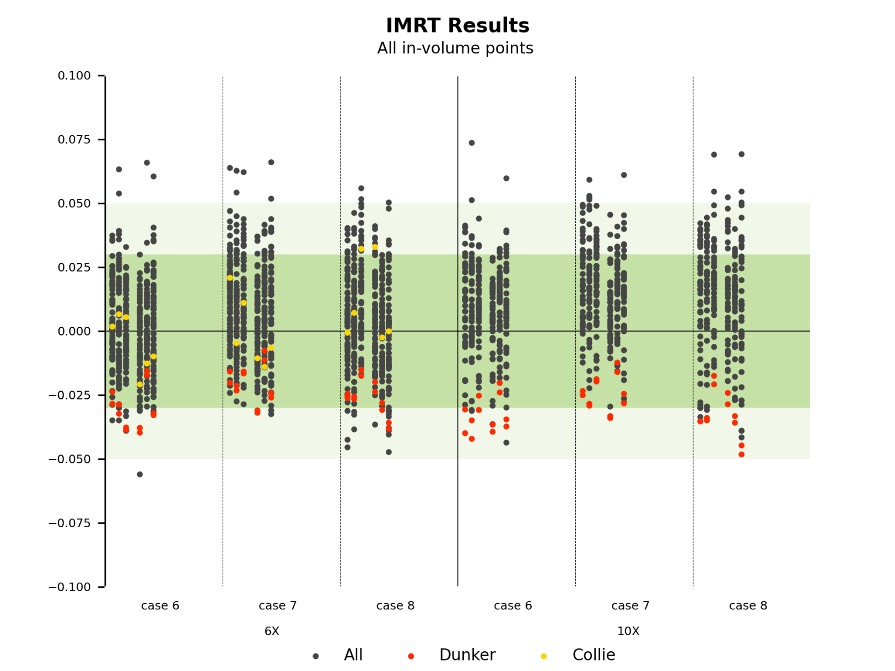

# Server

## 1. Project structure in Server

```java
.
├── AAB
│   ├── asgi.py
│   ├── settings.py
│   ├── urls.py
│   └── wsgi.py
├── apps
│   └── graphs
│       ├── Services
│       │   └── graphService.py
│       ├── admin.py
│       ├── apps.py
│       ├── migrations
│       ├── models.py
│       ├── serializers.py
│       ├── tests
│       │   ├── test_urls.py
│       │   └── test_views.py
│       ├── urls.py
│       └── views.py
├── utils
    ├── images
    ├── plGraphs  
    ├── plot.py
    └── sample.py

```

The above structure shows the main files and folders used in the server. 


### **1.1 Project setting:**

**`AAB/settings.py`:** 

The setting of this project includes the database setting.


**`AAB/urls.py`:** 

The url configuration of this project.


### **1.2 Apps:**

an app "graphs" is used to deal with the result and graph management.

**`graphs/models.py`:**

 Each model maps to a single database table. The Django provide ORM for database. To edit the table in the database, please following bellow steps :

1. Edit the models in models.py

2. Run the bellow commands to do the migrations of app "graphs" model . It will automatically synchronize the changes to the database

    ```command
    python manage.py makemigrations graphs
    python manage.py migrate
    ```

3. Each time the migration is performed, the related migration record will be recorded in the `graphs/migrations`

> Please see the below Django documentation links to see details.
>
> https://docs.djangoproject.com/en/3.1/intro/tutorial02/


**`graphs/serializers.py`:**

ModelSerializer of Django Rest Framwork is used for serializers. The ResultSerializer use the Nested relationships with other serializers.

> DRF documentation links:  [Serializers](https://www.django-rest-framework.org/api-guide/serializers/#serializers), [Serializer fields](https://www.django-rest-framework.org/api-guide/fields/#serializer-fields) and [Serializer relations](https://www.django-rest-framework.org/api-guide/relations/#serializer-relations).


**`graphs/views.py`:**

Views are mainly responsible for processing related logic of requests. 

> DRF documentation links:  [Class-based Views](https://www.django-rest-framework.org/api-guide/views/#class-based-views), [Generic views](https://www.django-rest-framework.org/api-guide/generic-views/#generic-views), [ViewSets](https://www.django-rest-framework.org/api-guide/viewsets/#viewsets)


Permissions are required for each views. Only the user who has permissions can use the views. In the current development stage, we use the following command line to quickly create a super user. The auth user will be store in the database table "auth_user". Each time create a new result, the request "user_id" will automatically be added into the result database table.

```
python manage.py createsuperuser
```

> DRF documentation links: [Permissions](https://www.django-rest-framework.org/api-guide/permissions/#permissions)


However, only basic authentication and http request are used now in current development stage. For example, super user "root" and password "root". Basic authentication is generally only appropriate for testing and developing. At present, we have not added and used other security verification methods. So please use a safe authentication method in the production environment.

> DRF documentation links: [Authentication](https://www.django-rest-framework.org/api-guide/authentication/#authentication)


**`graphs/graphService.py`**

Data processing before ploting graph


**`graphs/urls.py`:**

The url configuration of the app "graphs".


**`graphs/test`:**

This folder contains the tests used in development.


### **1.3 Utils**:

**`utils/plot.py`:**

Use processed data to plot the graph.


**`utils/plGraphs`:**

The folder contain the ploted graphs and is set as the MEDIA_ROOT. Then the local program get the graph from MEDIA_ROOT.

> DRF documentation links: [Managing files](https://docs.djangoproject.com/en/3.1/topics/files/#file-storage)


**`utils/images`:**

Contain the static images which are used for ploting.


## 2. API documentation

Run the server in local and use below url to open API documentation which is built with `drf_yasg`

http://127.0.0.1:8000/swagger/

Below shows the examples of  api request. Authorization is basic authorization with username = "root" and password = "root"

### 2.1 results

**GET /graphs/results/**

list all results

```http
GET /graphs/results/ HTTP/1.1
Host: 127.0.0.1:8000
Authorization: Basic cm9vdDpyb290
```


**POST /graphs/results/**

create a new result

```http
POST /graphs/results/ HTTP/1.1
Host: 127.0.0.1:8000
Authorization: Basic cm9vdDpyb290
Content-Type: application/json

{
    "AuditID": "4",
    "RevisionNumber": "5",
    "FacilityName": "Drever",
    "FacilityID": "3",
    "Auditor1": "3",
    "Auditor2": "3",
    "Auditor3": "3",
    "AuditDate": "2016-11-01",
    "RepDate": "3",
    "LinacModel": "3",
    "LinacManufacturer": "3",
    "PlanningSystemManufacturer": "3",
    "tps": "3",
    "Algorithm": "3",
    "kqFac": "3",
    "ACDS": "3",
    "Phantom": "3",
    "facilityOutput": [
        {"energy_6":1, "energy_10":1,"energy_15":1,"energy_18":1,"energy_6FFF":1,"energy_10FFF":1}
    ],
    "TPR": [
        {"energy_6":1, "energy_10":1,"energy_15":1,"energy_18":1,"energy_6FFF":1,"energy_10FFF":1}
    ],
    "Nds_3dcrt": [
        {
            "code_101106":0.01, "code_110106":0.01, "code_205106":0.01, "code_208106":0.01, "code_205206":0.01,
            "code_208206":0.01, "code_205306":0.01, "code_208306":0.01, "code_303106":0.01, "code_305106":0.01,
            "code_403106":0.01, "code_405106":0.01, "code_103110":0.01, "code_110110":0.01, "code_303110":0.01,
            "code_305110":0.01, "code_403110":0.01, "code_405110":0.01, "code_103115":0.01, "code_110115":0.01,
            "code_303115":0.01, "code_305115":0.01, "code_403115":0.01, "code_405115":0.01, "code_103118":0.01,
            "code_303118":0.01, "code_305118":0.01, "code_403118":0.01, "code_405118":0.01, "code_101105":0.01,
            "code_110105":0.01, "code_303105":0.01, "code_305105":0.01, "code_103109":0.01, "code_110109":0.01,
            "code_303109":0.01, "code_305109":0.01, "code_110118":0.01}
    ],
    "Nds_3dcrt_misdelivery": [
        {
            "code_101106":0, "code_110106":0, "code_205106":0, "code_208106":0, "code_205206":0,
            "code_208206":0, "code_205306":1, "code_208306":0, "code_303106":0, "code_305106":0,
            "code_403106":0, "code_405106":0, "code_103110":0, "code_110110":0, "code_303110":0,
            "code_305110":0, "code_403110":0, "code_405110":1, "code_103115":1, "code_110115":0,
            "code_303115":0, "code_305115":0, "code_403115":0, "code_405115":0, "code_103118":0,
            "code_303118":0, "code_305118":0, "code_403118":0, "code_405118":0, "code_101105":0,
            "code_110105":0, "code_303105":1, "code_305105":0, "code_103109":0, "code_110109":0,
            "code_303109":0, "code_305109":0, "code_110118":0}
    ],
    "Nds_imrt": [
        {
            "code_c6_p11_6": 0.026, "code_c6_p12_6": 0.024, "code_c6_p13_6": 0.015, "code_c6_p14_6": -0.01, "code_c6_p15_6": 0.005,
            "code_c6_p16_6": 0.018, "code_c6_p17_6": 0.024,
            "code_c7_p11_6": 0.029, "code_c7_p12_6": 0.036, "code_c7_p13_6": 0.033, "code_c7_p14_6": -0.009, "code_c7_p15_6": 0.014,
            "code_c7_p16_6": 0.017, "code_c7_p17_6": 0.02,
            "code_c8_p11_6": 0.018, "code_c8_p12_6": 0.021, "code_c8_p13_6": 0.013, "code_c8_p14_6": 0.46, "code_c8_p15_6": 0.019,
            "code_c8_p17_6": 0.064, "code_c8_p18_6": 0.039,
            "code_c6_p11_10": null, "code_c6_p12_10": null, "code_c6_p13_10": null, "code_c6_p14_10": null, "code_c6_p15_10": null,
            "code_c6_p16_10": null, "code_c6_p17_10": null,
            "code_c7_p11_10": null, "code_c7_p12_10": null, "code_c7_p13_10": null, "code_c7_p14_10": null, "code_c7_p15_10": null,
            "code_c7_p16_10": null, "code_c7_p17_10": null,
            "code_c8_p11_10": null, "code_c8_p12_10": null, "code_c8_p13_10": null, "code_c8_p14_10": null, "code_c8_p15_10": null,
            "code_c8_p17_10": null, "code_c8_p18_10": null
        }
    ],
    "Nds_imrt_misdelivery": [
        {
            "code_c6_p11_6": 1, "code_c6_p12_6": 0, "code_c6_p13_6": 0, "code_c6_p14_6": 0, "code_c6_p15_6": 0,
            "code_c6_p16_6": 0, "code_c6_p17_6": 0,
            "code_c7_p11_6": 0, "code_c7_p12_6": 0, "code_c7_p13_6": 0, "code_c7_p14_6": 0, "code_c7_p15_6": 0,
            "code_c7_p16_6": 0, "code_c7_p17_6": 0,
            "code_c8_p11_6": 0, "code_c8_p12_6": 0, "code_c8_p13_6": 0, "code_c8_p14_6": 1, "code_c8_p15_6": 0,
            "code_c8_p17_6": 0, "code_c8_p18_6": 0,
            "code_c6_p11_10": 0, "code_c6_p12_10": 0, "code_c6_p13_10": 0, "code_c6_p14_10": 0, "code_c6_p15_10": 0,
            "code_c6_p16_10": 0, "code_c6_p17_10": 0,
            "code_c7_p11_10": 0, "code_c7_p12_10": 0, "code_c7_p13_10": 0, "code_c7_p14_10": 1, "code_c7_p15_10": 0,
            "code_c7_p16_10": 0, "code_c7_p17_10": 0,
            "code_c8_p11_10": 0, "code_c8_p12_10": 0, "code_c8_p13_10": 0, "code_c8_p14_10": 0, "code_c8_p15_10": 0,
            "code_c8_p17_10": 0, "code_c8_p18_10": 0
        }
    ]
}
```


**GET  /results/{id}/**

get the results which id=1

```http
GET /graphs/results/1/ HTTP/1.1
Host: 127.0.0.1:8000
Authorization: Basic cm9vdDpyb290
```


**PUT /results/{id}/**

update the results which id=1

```http
PUT /graphs/results/1/ HTTP/1.1
Host: 127.0.0.1:8000
Authorization: Basic cm9vdDpyb290
Content-Type: application/json

{
    "AuditID": "4",
    "RevisionNumber": "5",
    "FacilityName": "Drever",
    "FacilityID": "3",
    "Auditor1": "3",
    "Auditor2": "3",
    "Auditor3": "3",
    "AuditDate": "2016-11-01",
    "RepDate": "3",
    "LinacModel": "3",
    "LinacManufacturer": "3",
    "PlanningSystemManufacturer": "3",
    "tps": "3",
    "Algorithm": "3",
    "kqFac": "3",
    "ACDS": "3",
    "Phantom": "3",
    "facilityOutput": [
        {"energy_6":1, "energy_10":1,"energy_15":1,"energy_18":1,"energy_6FFF":1,"energy_10FFF":1}
    ],
    "TPR": [
        {"energy_6":1, "energy_10":1,"energy_15":1,"energy_18":1,"energy_6FFF":1,"energy_10FFF":1}
    ],
    "Nds_3dcrt": [
        {
            "code_101106":0.02, "code_110106":0.01, "code_205106":0.01, "code_208106":0.01, "code_205206":0.01,
            "code_208206":0.01, "code_205306":0.01, "code_208306":0.01, "code_303106":0.01, "code_305106":0.01,
            "code_403106":0.01, "code_405106":0.01, "code_103110":0.01, "code_110110":0.01, "code_303110":0.01,
            "code_305110":0.01, "code_403110":0.01, "code_405110":0.01, "code_103115":0.01, "code_110115":0.01,
            "code_303115":0.01, "code_305115":0.01, "code_403115":0.01, "code_405115":0.01, "code_103118":0.01,
            "code_303118":0.01, "code_305118":0.01, "code_403118":0.01, "code_405118":0.01, "code_101105":0.01,
            "code_110105":0.01, "code_303105":0.01, "code_305105":0.01, "code_103109":0.01, "code_110109":0.01,
            "code_303109":0.01, "code_305109":0.01, "code_110118":0.01}
    ],
    "Nds_3dcrt_misdelivery": [
        {
            "code_101106":0, "code_110106":0, "code_205106":0, "code_208106":0, "code_205206":0,
            "code_208206":0, "code_205306":1, "code_208306":0, "code_303106":0, "code_305106":0,
            "code_403106":0, "code_405106":0, "code_103110":0, "code_110110":0, "code_303110":0,
            "code_305110":0, "code_403110":0, "code_405110":1, "code_103115":1, "code_110115":0,
            "code_303115":0, "code_305115":0, "code_403115":0, "code_405115":0, "code_103118":0,
            "code_303118":0, "code_305118":0, "code_403118":0, "code_405118":0, "code_101105":0,
            "code_110105":0, "code_303105":1, "code_305105":0, "code_103109":0, "code_110109":0,
            "code_303109":0, "code_305109":0, "code_110118":0}
    ],
    "Nds_imrt": [
        {
            "code_c6_p11_6": 0.026, "code_c6_p12_6": 0.024, "code_c6_p13_6": 0.015, "code_c6_p14_6": -0.01, "code_c6_p15_6": 0.005,
            "code_c6_p16_6": 0.018, "code_c6_p17_6": 0.024,
            "code_c7_p11_6": 0.029, "code_c7_p12_6": 0.036, "code_c7_p13_6": 0.033, "code_c7_p14_6": -0.009, "code_c7_p15_6": 0.014,
            "code_c7_p16_6": 0.017, "code_c7_p17_6": 0.02,
            "code_c8_p11_6": 0.018, "code_c8_p12_6": 0.021, "code_c8_p13_6": 0.013, "code_c8_p14_6": 0.46, "code_c8_p15_6": 0.019,
            "code_c8_p17_6": 0.064, "code_c8_p18_6": 0.039,
            "code_c6_p11_10": null, "code_c6_p12_10": null, "code_c6_p13_10": null, "code_c6_p14_10": null, "code_c6_p15_10": null,
            "code_c6_p16_10": null, "code_c6_p17_10": null,
            "code_c7_p11_10": null, "code_c7_p12_10": null, "code_c7_p13_10": null, "code_c7_p14_10": null, "code_c7_p15_10": null,
            "code_c7_p16_10": null, "code_c7_p17_10": null,
            "code_c8_p11_10": null, "code_c8_p12_10": null, "code_c8_p13_10": null, "code_c8_p14_10": null, "code_c8_p15_10": null,
            "code_c8_p17_10": null, "code_c8_p18_10": null
        }
    ],
    "Nds_imrt_misdelivery": [
        {
            "code_c6_p11_6": 1, "code_c6_p12_6": 0, "code_c6_p13_6": 0, "code_c6_p14_6": 0, "code_c6_p15_6": 0,
            "code_c6_p16_6": 0, "code_c6_p17_6": 0,
            "code_c7_p11_6": 0, "code_c7_p12_6": 0, "code_c7_p13_6": 0, "code_c7_p14_6": 0, "code_c7_p15_6": 0,
            "code_c7_p16_6": 0, "code_c7_p17_6": 0,
            "code_c8_p11_6": 0, "code_c8_p12_6": 0, "code_c8_p13_6": 0, "code_c8_p14_6": 1, "code_c8_p15_6": 0,
            "code_c8_p17_6": 0, "code_c8_p18_6": 0,
            "code_c6_p11_10": 0, "code_c6_p12_10": 0, "code_c6_p13_10": 0, "code_c6_p14_10": 0, "code_c6_p15_10": 0,
            "code_c6_p16_10": 0, "code_c6_p17_10": 0,
            "code_c7_p11_10": 0, "code_c7_p12_10": 0, "code_c7_p13_10": 0, "code_c7_p14_10": 1, "code_c7_p15_10": 0,
            "code_c7_p16_10": 0, "code_c7_p17_10": 0,
            "code_c8_p11_10": 0, "code_c8_p12_10": 0, "code_c8_p13_10": 0, "code_c8_p14_10": 0, "code_c8_p15_10": 0,
            "code_c8_p17_10": 0, "code_c8_p18_10": 0
        }
    ]
}
```


**DELETE  /results/{id}/**

delete the result which id=1

```http
DELETE /graphs/results/1/ HTTP/1.1
Host: 127.0.0.1:8000
Authorization: Basic cm9vdDpyb290
```


### 2.2 resultsList

**POST /graphs/resultsList/**

create new results. 

[{Result1},{Result2}]

```http
POST /graphs/resultsList/ HTTP/1.1
Host: 127.0.0.1:8000
Authorization: Basic cm9vdDpyb290
Content-Type: application/json

[
    {
        "AuditID": "4",
        "RevisionNumber": "5",
        "FacilityName": "Avocet",
        "FacilityID": "3",
        "Auditor1": "3",
        "Auditor2": "3",
        "Auditor3": "3",
        "AuditDate": "2016-11-01",
        "RepDate": "3",
        "LinacModel": "3",
        "LinacManufacturer": "3",
        "PlanningSystemManufacturer": "3",
        "tps": "3",
        "Algorithm": "3",
        "kqFac": "3",
        "ACDS": "3",
        "Phantom": "3",
        "facilityOutput": [
            {"energy_6":1, "energy_10":1,"energy_15":1,"energy_18":1,"energy_6FFF":1,"energy_10FFF":1}
        ],
        "TPR": [
            {"energy_6":1, "energy_10":1,"energy_15":1,"energy_18":1,"energy_6FFF":1,"energy_10FFF":1}
        ],
        "Nds_3dcrt": [
            {
                "code_101106":0.01, "code_110106":0.01, "code_205106":0.01, "code_208106":0.01, "code_205206":0.01,
                "code_208206":0.01, "code_205306":0.01, "code_208306":0.01, "code_303106":0.01, "code_305106":0.01,
                "code_403106":0.01, "code_405106":0.01, "code_103110":0.01, "code_110110":0.01, "code_303110":0.01,
                "code_305110":0.01, "code_403110":0.01, "code_405110":0.01, "code_103115":0.01, "code_110115":0.01,
                "code_303115":0.01, "code_305115":0.01, "code_403115":0.01, "code_405115":0.01, "code_103118":0.01,
                "code_303118":0.01, "code_305118":0.01, "code_403118":0.01, "code_405118":0.01, "code_101105":0.01,
                "code_110105":0.01, "code_303105":0.01, "code_305105":0.01, "code_103109":0.01, "code_110109":0.01,
                "code_303109":0.01, "code_305109":0.01, "code_110118":0.01}
        ],
        "Nds_3dcrt_misdelivery": [
            {
                "code_101106":0, "code_110106":0, "code_205106":0, "code_208106":0, "code_205206":0,
                "code_208206":0, "code_205306":1, "code_208306":0, "code_303106":0, "code_305106":0,
                "code_403106":0, "code_405106":0, "code_103110":0, "code_110110":0, "code_303110":0,
                "code_305110":0, "code_403110":0, "code_405110":1, "code_103115":1, "code_110115":0,
                "code_303115":0, "code_305115":0, "code_403115":0, "code_405115":0, "code_103118":0,
                "code_303118":0, "code_305118":0, "code_403118":0, "code_405118":0, "code_101105":0,
                "code_110105":0, "code_303105":1, "code_305105":0, "code_103109":0, "code_110109":0,
                "code_303109":0, "code_305109":0, "code_110118":0}
        ],
        "Nds_imrt": [
            {
                "code_c6_p11_6": 0.026, "code_c6_p12_6": 0.024, "code_c6_p13_6": 0.015, "code_c6_p14_6": -0.01, "code_c6_p15_6": 0.005,
                "code_c6_p16_6": 0.018, "code_c6_p17_6": 0.024,
                "code_c7_p11_6": 0.029, "code_c7_p12_6": 0.036, "code_c7_p13_6": 0.033, "code_c7_p14_6": -0.009, "code_c7_p15_6": 0.014,
                "code_c7_p16_6": 0.017, "code_c7_p17_6": 0.02,
                "code_c8_p11_6": 0.018, "code_c8_p12_6": 0.021, "code_c8_p13_6": 0.013, "code_c8_p14_6": 0.46, "code_c8_p15_6": 0.019,
                "code_c8_p17_6": 0.064, "code_c8_p18_6": 0.039,
                "code_c6_p11_10": null, "code_c6_p12_10": null, "code_c6_p13_10": null, "code_c6_p14_10": null, "code_c6_p15_10": null,
                "code_c6_p16_10": null, "code_c6_p17_10": null,
                "code_c7_p11_10": null, "code_c7_p12_10": null, "code_c7_p13_10": null, "code_c7_p14_10": null, "code_c7_p15_10": null,
                "code_c7_p16_10": null, "code_c7_p17_10": null,
                "code_c8_p11_10": null, "code_c8_p12_10": null, "code_c8_p13_10": null, "code_c8_p14_10": null, "code_c8_p15_10": null,
                "code_c8_p17_10": null, "code_c8_p18_10": null
            }
        ],
        "Nds_imrt_misdelivery": [
            {
                "code_c6_p11_6": 1, "code_c6_p12_6": 0, "code_c6_p13_6": 0, "code_c6_p14_6": 0, "code_c6_p15_6": 0,
                "code_c6_p16_6": 0, "code_c6_p17_6": 0,
                "code_c7_p11_6": 0, "code_c7_p12_6": 0, "code_c7_p13_6": 0, "code_c7_p14_6": 0, "code_c7_p15_6": 0,
                "code_c7_p16_6": 0, "code_c7_p17_6": 0,
                "code_c8_p11_6": 0, "code_c8_p12_6": 0, "code_c8_p13_6": 0, "code_c8_p14_6": 1, "code_c8_p15_6": 0,
                "code_c8_p17_6": 0, "code_c8_p18_6": 0,
                "code_c6_p11_10": 0, "code_c6_p12_10": 0, "code_c6_p13_10": 0, "code_c6_p14_10": 0, "code_c6_p15_10": 0,
                "code_c6_p16_10": 0, "code_c6_p17_10": 0,
                "code_c7_p11_10": 0, "code_c7_p12_10": 0, "code_c7_p13_10": 0, "code_c7_p14_10": 1, "code_c7_p15_10": 0,
                "code_c7_p16_10": 0, "code_c7_p17_10": 0,
                "code_c8_p11_10": 0, "code_c8_p12_10": 0, "code_c8_p13_10": 0, "code_c8_p14_10": 0, "code_c8_p15_10": 0,
                "code_c8_p17_10": 0, "code_c8_p18_10": 0
            }
        ]
    },
    {
        "AuditID": "4",
        "RevisionNumber": "5",
        "FacilityName": "Drever",
        "FacilityID": "3",
        "Auditor1": "3",
        "Auditor2": "3",
        "Auditor3": "3",
        "AuditDate": "2016-11-01",
        "RepDate": "3",
        "LinacModel": "3",
        "LinacManufacturer": "3",
        "PlanningSystemManufacturer": "3",
        "tps": "3",
        "Algorithm": "3",
        "kqFac": "3",
        "ACDS": "3",
        "Phantom": "3",
        "facilityOutput": [
            {"energy_6":1, "energy_10":1,"energy_15":1,"energy_18":1,"energy_6FFF":1,"energy_10FFF":1}
        ],
        "TPR": [
            {"energy_6":1, "energy_10":1,"energy_15":1,"energy_18":1,"energy_6FFF":1,"energy_10FFF":1}
        ],
        "Nds_3dcrt": [
            {
                "code_101106":0.01, "code_110106":0.01, "code_205106":0.01, "code_208106":0.01, "code_205206":0.01,
                "code_208206":0.01, "code_205306":0.01, "code_208306":0.01, "code_303106":0.01, "code_305106":0.01,
                "code_403106":0.01, "code_405106":0.01, "code_103110":0.01, "code_110110":0.01, "code_303110":0.01,
                "code_305110":0.01, "code_403110":0.01, "code_405110":0.01, "code_103115":0.01, "code_110115":0.01,
                "code_303115":0.01, "code_305115":0.01, "code_403115":0.01, "code_405115":0.01, "code_103118":0.01,
                "code_303118":0.01, "code_305118":0.01, "code_403118":0.01, "code_405118":0.01, "code_101105":0.01,
                "code_110105":0.01, "code_303105":0.01, "code_305105":0.01, "code_103109":0.01, "code_110109":0.01,
                "code_303109":0.01, "code_305109":0.01, "code_110118":0.01}
        ],
        "Nds_3dcrt_misdelivery": [
            {
                "code_101106":0, "code_110106":0, "code_205106":0, "code_208106":0, "code_205206":0,
                "code_208206":0, "code_205306":1, "code_208306":0, "code_303106":0, "code_305106":0,
                "code_403106":0, "code_405106":0, "code_103110":0, "code_110110":0, "code_303110":0,
                "code_305110":0, "code_403110":0, "code_405110":1, "code_103115":1, "code_110115":0,
                "code_303115":0, "code_305115":0, "code_403115":0, "code_405115":0, "code_103118":0,
                "code_303118":0, "code_305118":0, "code_403118":0, "code_405118":0, "code_101105":0,
                "code_110105":0, "code_303105":1, "code_305105":0, "code_103109":0, "code_110109":0,
                "code_303109":0, "code_305109":0, "code_110118":0}
        ],
        "Nds_imrt": [
            {
                "code_c6_p11_6": 0.026, "code_c6_p12_6": 0.024, "code_c6_p13_6": 0.015, "code_c6_p14_6": -0.01, "code_c6_p15_6": 0.005,
                "code_c6_p16_6": 0.018, "code_c6_p17_6": 0.024,
                "code_c7_p11_6": 0.029, "code_c7_p12_6": 0.036, "code_c7_p13_6": 0.033, "code_c7_p14_6": -0.009, "code_c7_p15_6": 0.014,
                "code_c7_p16_6": 0.017, "code_c7_p17_6": 0.02,
                "code_c8_p11_6": 0.018, "code_c8_p12_6": 0.021, "code_c8_p13_6": 0.013, "code_c8_p14_6": 0.46, "code_c8_p15_6": 0.019,
                "code_c8_p17_6": 0.064, "code_c8_p18_6": 0.039,
                "code_c6_p11_10": null, "code_c6_p12_10": null, "code_c6_p13_10": null, "code_c6_p14_10": null, "code_c6_p15_10": null,
                "code_c6_p16_10": null, "code_c6_p17_10": null,
                "code_c7_p11_10": null, "code_c7_p12_10": null, "code_c7_p13_10": null, "code_c7_p14_10": null, "code_c7_p15_10": null,
                "code_c7_p16_10": null, "code_c7_p17_10": null,
                "code_c8_p11_10": null, "code_c8_p12_10": null, "code_c8_p13_10": null, "code_c8_p14_10": null, "code_c8_p15_10": null,
                "code_c8_p17_10": null, "code_c8_p18_10": null
            }
        ],
        "Nds_imrt_misdelivery": [
            {
                "code_c6_p11_6": 1, "code_c6_p12_6": 0, "code_c6_p13_6": 0, "code_c6_p14_6": 0, "code_c6_p15_6": 0,
                "code_c6_p16_6": 0, "code_c6_p17_6": 0,
                "code_c7_p11_6": 0, "code_c7_p12_6": 0, "code_c7_p13_6": 0, "code_c7_p14_6": 0, "code_c7_p15_6": 0,
                "code_c7_p16_6": 0, "code_c7_p17_6": 0,
                "code_c8_p11_6": 0, "code_c8_p12_6": 0, "code_c8_p13_6": 0, "code_c8_p14_6": 1, "code_c8_p15_6": 0,
                "code_c8_p17_6": 0, "code_c8_p18_6": 0,
                "code_c6_p11_10": 0, "code_c6_p12_10": 0, "code_c6_p13_10": 0, "code_c6_p14_10": 0, "code_c6_p15_10": 0,
                "code_c6_p16_10": 0, "code_c6_p17_10": 0,
                "code_c7_p11_10": 0, "code_c7_p12_10": 0, "code_c7_p13_10": 0, "code_c7_p14_10": 1, "code_c7_p15_10": 0,
                "code_c7_p16_10": 0, "code_c7_p17_10": 0,
                "code_c8_p11_10": 0, "code_c8_p12_10": 0, "code_c8_p13_10": 0, "code_c8_p14_10": 0, "code_c8_p15_10": 0,
                "code_c8_p17_10": 0, "code_c8_p18_10": 0
            }
        ]
    }
]
```


### 2.3 graphManage

**GET  /graphManage/**

get all the graphs information

```http
GET /graphs/graphManage/ HTTP/1.1
Host: 127.0.0.1:8000
Authorization: Basic cm9vdDpyb290
```


**POST  /graphManage/**

plot graph.

**`graphType`:**

There are two graph type now: `NDS_IMRT` and `NDS_3DCRT`


**`NDS_3DCRT`:**

NDS_3DCRT has one mode: `all`


**`NDS_IMRT`:**

NDS_IMRT has three modes: `all`, `std` and `average`


**`facilitys`:**

Used to specify the data that needs to be ploted and highlighted.

```
<FacilityName> : [<list of result_id>]
```

For example, in the below example request, the results with `id=194` and `id=195` have the FacilityName `Dunker`. and the results which `id=154` has the FacilityName `Collie`. Those three results will be highlighted and showed. The  `All`  dataset are showed in the below graph with black points. `All` dataset has all the results exclude those three results highlighted.

```http
POST /graphs/graphManage/ HTTP/1.1
Host: 127.0.0.1:8000
Authorization: Basic cm9vdDpyb290
Content-Type: application/json

{   
    "graphType": "NDS_IMRT",
    "mode": "all",
    "facilitys":{
        "Dunker" : [194, 195],
        "Collie": [154]
    }
}
```




**DELETE /graphManage/**

Delete the graphs information in database and the relative files.

The graphs which id in the `graphs_list` will be deleted.

```http
DELETE /graphs/graphManage/ HTTP/1.1
Host: 127.0.0.1:8000
Authorization: Basic cm9vdDpyb290
Content-Type: application/json

{
    "graphs_list":[10]
}
```


## 3. Future development

- Replace the basic authentication with a safe authentication in product environment.
- Extend the api according the other graph types.


## 4. Relative links

Django documentation   https://docs.djangoproject.com/en/3.1/

Django REST framework documentation  https://www.django-rest-framework.org/

