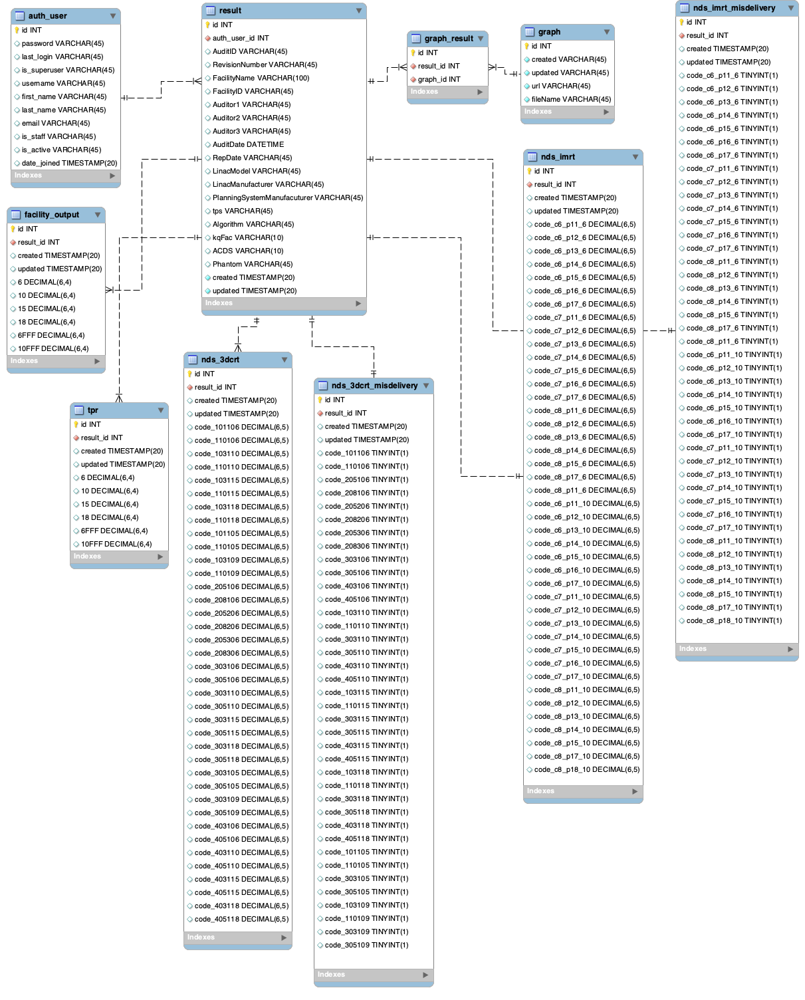
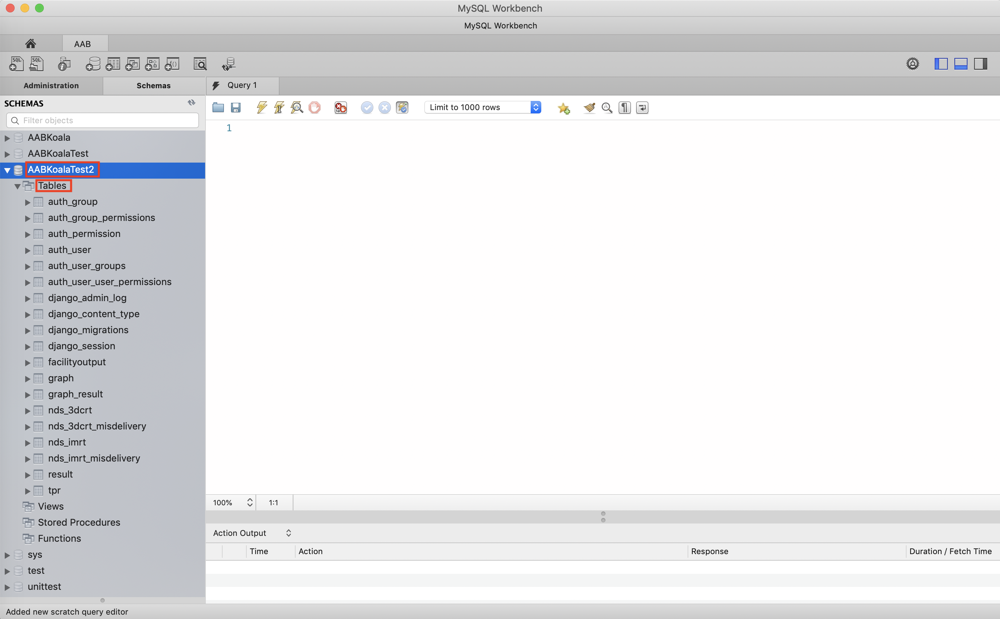
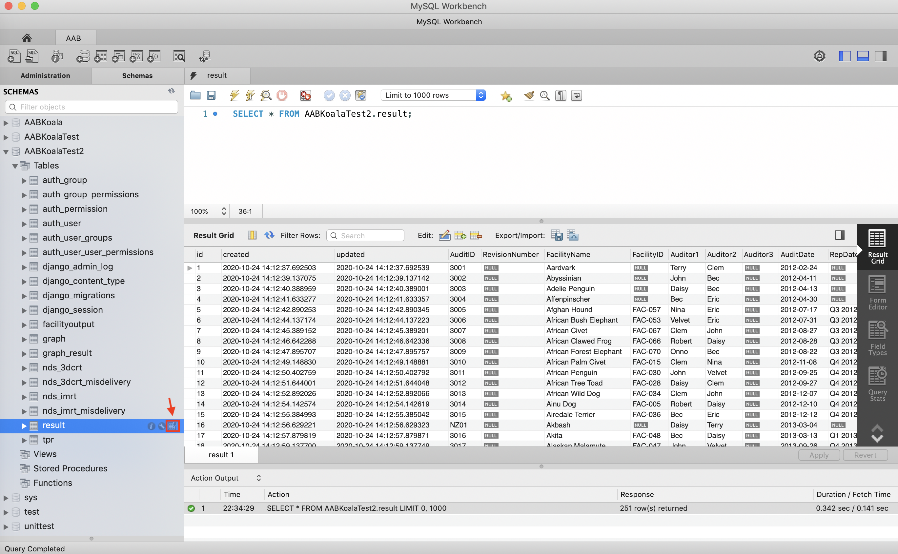
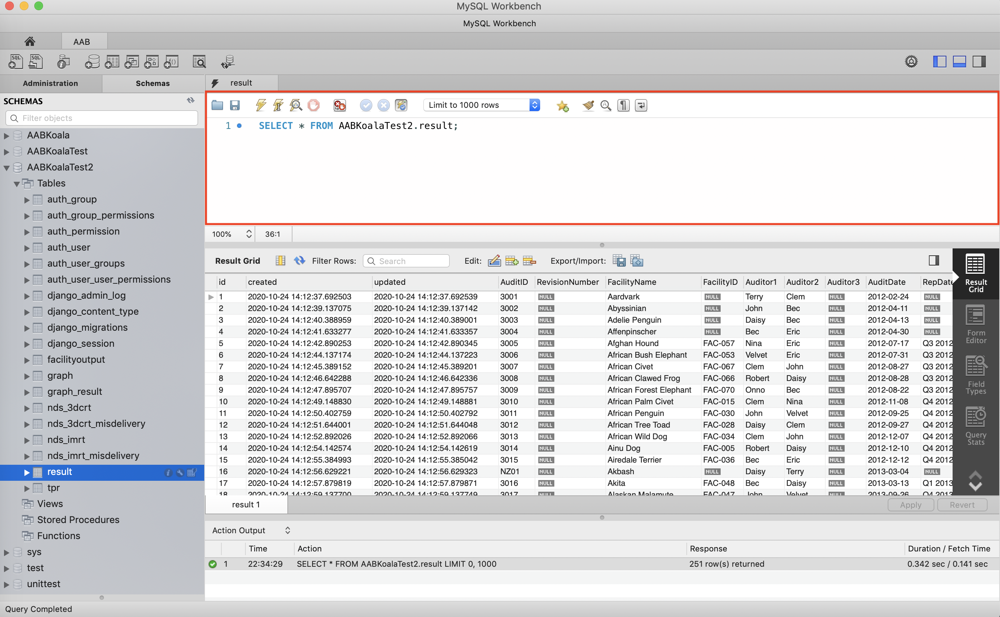
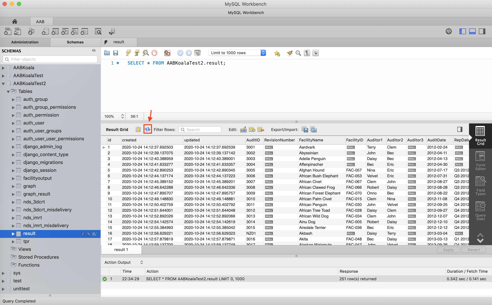

# AA-Koala Database Guide

## Introduction
MySQL is a widely used open-sourced relational database management system. We choose MySQL as the backend database for its strengths of efficiently storing structured data like audit results and being compatible with a common and reliable database programming language tool, SQL. This documentation will introduce the database structure established for the Automated Audit Benchmarking project and provide guidelines about working on MySQL Workbench.

## Database structure of the Automated Audit Benchmarking project
### Entity-Relationship (ER) diagram


The [ER model](https://www.guru99.com/er-diagram-tutorial-dbms.html) shows the big picture of how different data relates to each other. The dotted lines express the cardinality between entities (tables). The lines link the table whoever have some kind of relationship with the others. The core component of the diagram is the `result` table, which corresponds to the Results tab from the original spreadsheet. Everything needed to build a complete result record are stored in `result` presented by rows of attributes. As audit data can be processed with different types of treatment such as 3DCRT and IMRT, we split this treatment information into separate tables for explicitness on plotting the graphs based on different treatment plans applied. 3DCRT-related tables include `nds_3dcrt` and `nds_3dcrt_misdelivery`, where IMRT-related tables include `nds_imrt` and `nds_imrt_misdelivery`.

* Case data: Stored as `result` table
* Prior data: 
  * TPR: Stored as `tpr` table
  * Facility Stated Daily Output (cGy/MU): stored as `facility_output` table 
Now we have both Case data and Prior data in place, we can utilise this information to plot graphs and store graph-related data into the `graph` table.\ 
**Note**: There is a `graph_result` table in between `result` and `graph`. A result record can be used to plot multiple graphs and a graph can be plotted by multiple result records. This table is created to indicate the so-called [Many-to-many relationship](https://en.wikipedia.org/wiki/Many-to-many_(data_model)) between `result` table and `graph` table. 
* `auth_user` table: Store database user information

Let's have a look at the tables.

### result

The `result` table represents the Results tab from the ARPANSA Audit spreadsheet. Each row in the table represents an attribute. The fields in the Results tab are identified in the `result` table as the following corresponding attribute names.
The capitalised word after an attribute name is the data type of the attribute. For example, `id INT` means an id can be assigned to an integer value in the range of -2147483648 to 2147483647, where `AuditID VARCHAR (45)` means an AuditID can be stored in maximum 45 characters. For more details on this please check [Chapter 11 Data Types](https://dev.mysql.com/doc/refman/8.0/en/data-types.html).

* **`id`**: The unique identifier for each audit result. This is the Primary Key (PK) of the table.\
\* PK: Each result record has its own id as the PK in the database to prevent confusion with other records.
* **`auth_user_id`**: The Foreign Key (FK) of `auth_user` table. In this case, it shows the connection between results and authorised users by putting `id` from `auth_user` table into `result` table. Every authorised user has permission to create results and update them. The FK helps recognise the affiliation between result data and the user who creates it.\
\* FK: When a table has a relationship with another table, they are linked by storing one table's PK to the other table as the latter's FK.
* **`AuditID`**: The `Audit ID` field in Results tab.
* **`RevisionNumber`**: The `Revision #` field in Results tab.
* **`FacilityName`**: The `Facility ID` field in Results tab.
* **`FacilityID`**: The The field right next to `Facility ID` field in Results tab (column D).
* **`Auditor1`**: The `Auditor1` field in Results tab.
* **`Auditor2`**: The `Auditor2` field in Results tab.
* **`Auditor3`**: The `Auditor3` field in Results tab.
* **`AuditDate`**: The `Au date` field in Results tab.
* **`RepDate`**: The `Rep date` field in Results tab.
* **`LinacModel`**: The `Linac model` field in Results tab.
* **`LinacManufacturer`**: The `Linac manufacturer` field in Results tab.
* **`PlanningSystemManufacturer`**: The `Planning System manufacturer` field in Results tab.
* **`tps`**: The `Planning System Name` field in Results tab.
* **`Algorithm`**: The `algorithm` field in Results tab.
* **`kqFac`**: The `kQ Fac.` field in Results tab.
* **`ACDS`**: The `ACDS` field in Results tab.
* **`Phantom`**: The `Phantom` field in Results tab.
* **`created`**: The actual date and time the result is created.
* **`updated`**: The actual date and time the result is updated.

### auth_user
This table is to save the details of the database users.

* **`id`**: The unique identifier (PK) for each authorised database user.
* **`password`**: The password set for your MySQL Connection.
* **`last_login`**: The most current time the user logs into the database system.
* **`is_superuser`**: Whether the user is a superuser. 1 represents a superuser, 0 represents a non superuser.
* **`username`**: The username set for your MySQL Connection.
* **`first_name`**: The first name of the user.
* **`last_name`**: The last name of the user.
* **`email`**: The email address of the user.
* **`is_staff`**: Whether the user is a staff member. 1 represents a staff user, 0 represents a non-staff user.
* **`is_active`**: Whether the user is active in using the database. 1 represents an active user, 0 represents a non active user.
* **`date_joined`**: The actual date and time the user creates a new MySQL Connection and starts using the database.

### facility_output

* **`id`**: The unique identifier (PK) for each result's facility output.
* **`result_id`**: The FK of `result` table.
* **`created`**: The actual date and time the result is created.
* **`updated`**: The actual date and time the result is updated.
* **`6`**, **`10`**, **`15`**, **`18`**, **`6FFF`**, **`10FFF`**: The energy information of Daily Output Factor (cGy/MU).

### tpr

* **`id`**: The unique identifier (PK) for each result's tpr.
* **`result_id`**: The FK of `result` table.
* **`created`**: The actual date and time the result is created.
* **`updated`**: The actual date and time the result is updated.
* **`6`**, **`10`**, **`15`**, **`18`**, **`6FFF`**, **`10FFF`**: The energy information of TPR.

### graph_result

* **`id`**: The unique identifier (PK) for each result-graph corresponding record.
* **`result_id`**: The FK of `result` table.
* **`graph_id`**: The FK of `graph` table.

### graph

* **`id`**: The unique identifier (PK) for each generated graph.
* **`created`**: The actual date and time the graph is created.
* **`updated`**: The actual date and time the graph is updated.
* **`url`**: The server path the graph is stored.
* **`fileName`**: The name of the graph file, e.g., 3DCRT_1603551977776.png

### nds_3dcrt

* **`id`**: The unique identifier (PK) for each result treated with 3DCRT.
* **`result_id`**: The FK of `result` table.
* **`created`**: The actual date and time the result is created.
* **`updated`**: The actual date and time the result is updated.
* From **`code_101106`** to the last: The detailed information for plotting graphs with NatDataSet 3DCRT.

### nds_3dcrt_misdelivery

* **`id`**: The unique identifier (PK) for 3DCRT Misdelivery information of each result.
* **`result_id`**: The FK of `result` table.
* **`created`**: The actual date and time the result is created.
* **`updated`**: The actual date and time the result is updated.
* From **`code_101106`** to the last: The misdeliveries for plotting graphs with NatDataSet 3DCRT.

### nds_imrt

* **`id`**: The unique identifier (PK) for each result treated with IMRT.
* **`result_id`**: The FK of `result` table.
* **`created`**: The actual date and time the result is created.
* **`updated`**: The actual date and time the result is updated.
* From **`code_c6_p11_6`** to the last: The detailed information for plotting graphs with NatDataSet IMRT.

### nds_imrt_misdelivery

* **`id`**: The unique identifier (PK) for IMRT Misdelivery information of each result.
* **`result_id`**: The FK of `result` table.
* **`created`**: The actual date and time the result is created.
* **`updated`**: The actual date and time the result is updated.
* From **`code_c6_p11_6`** to the last: The misdeliveries for plotting graphs with NatDataSet IMRT.


## MySQL Workbench guideline
### Steps 

1. After loggin into your MySQL connection, select your schema (e.g., AABKoalaTest2) and click `Tables` to see the list of all the tables in the database.


2. Click the table icon to get all the rows of records stored in a table. 
\
You can see a default query in the SQL field. For example,

This means to select all the records from *result* table in *AABKoalaTest2* schema.

3. To get the newest version of records in a table, click the double-arrow icon to refresh the table. This gets the most current data by re-executing the default query.


4. Additonally, you can perform other SQL queries to filter the data based on different aspects.\
For example,
* Find all results on 2020-10-24
```sql
SELECT * FROM AABKoalaTest2.result
WHERE result.created LIKE '2020-10-24%';
```
This query selects all the records from *result* table with the *created* column starting with 2020-10-24.
* Find all results generated by the facility Asiatic Black Bear
```sql
SELECT * FROM AABKoalaTest2.result
WHERE result.FacilityName = 'Asiatic Black Bear';
```
This query selects all the records from *result* table with the *FacilityName* column equaling to Asiatic Black Bear.

## For more information
Please go to [MySQL Reference Manual](https://dev.mysql.com/doc/refman/8.0/en/) on how to write SQL queries.

Please go to [Documentation](https://dev.mysql.com/doc/workbench/en/) for complete usage of MySQL Workbench.


