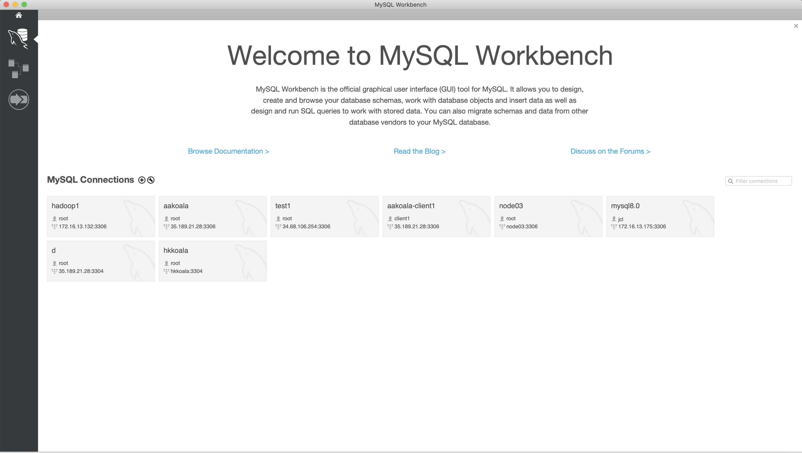
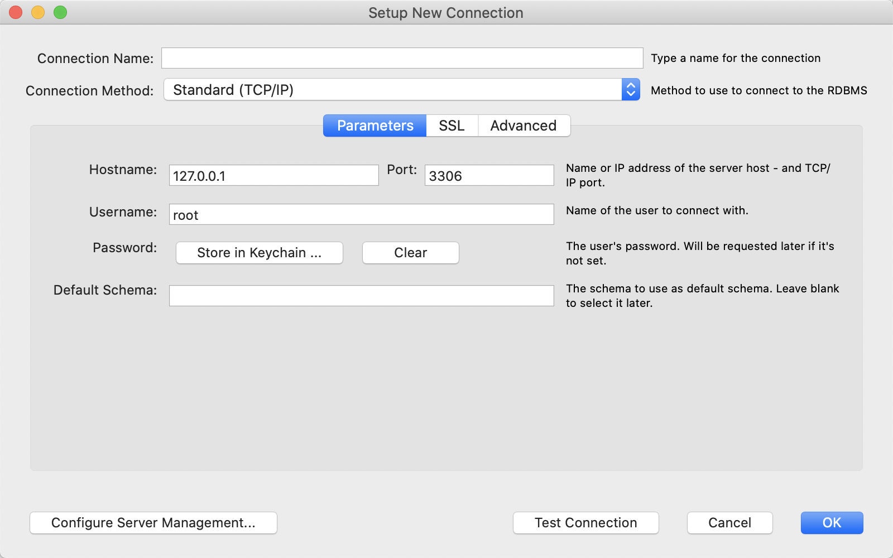
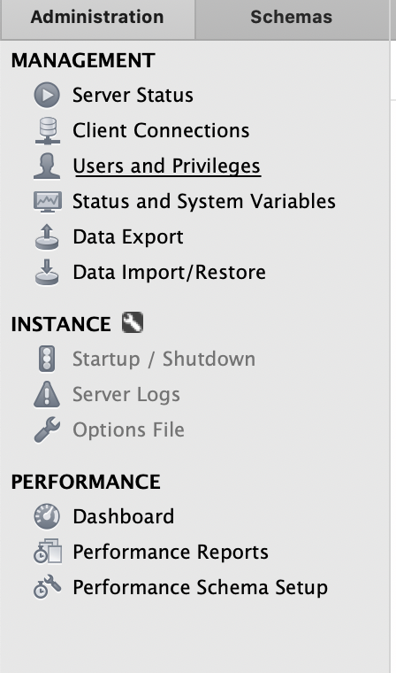
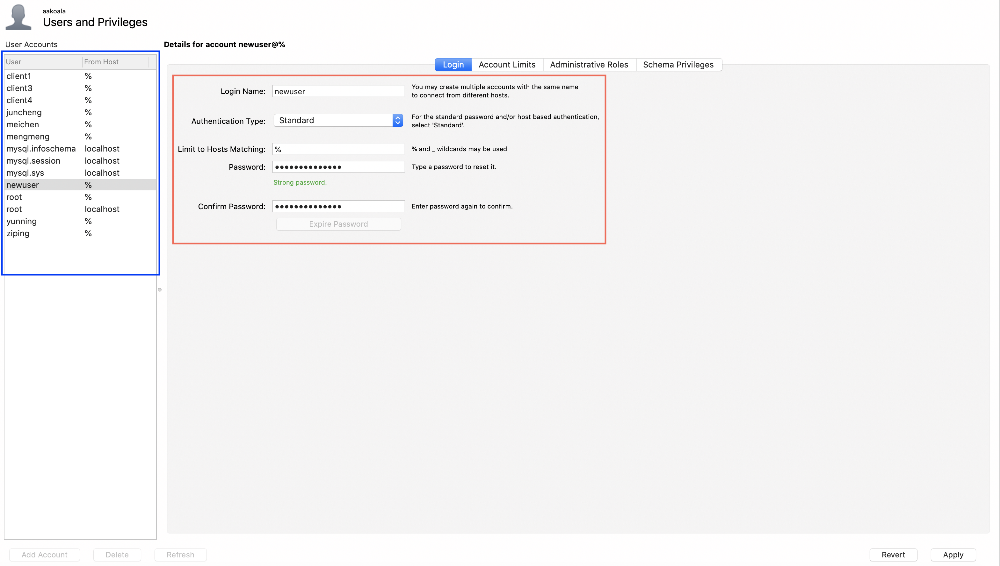
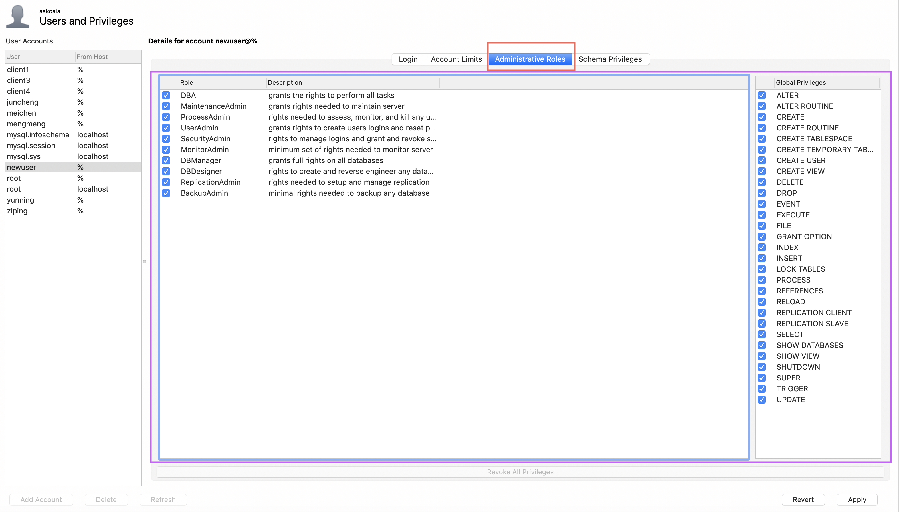
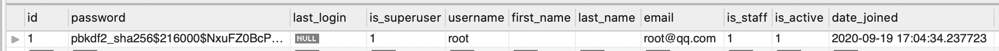

# AA-Koala Deployment Guide

## Recommended System Requirement

* **CPU**: 3.2GHz x 2 cores
* **RAM**: 16GB
* **Hard drive**: 40GB
* **Operating** **system**: Linux(e.g. ubuntu or centOS with docker and git installed)

## Before you start: Make sure Docker and Git are installed on the Server

### Install Docker and Docker-Compose

* Install Docker (Here takes centOS as an example. For other operating system, instructions can be found here https://docs.docker.com/engine/install/centos/)

  ```shell
  # install and start docker
  sudo yum install -y yum-utils
  sudo yum-config-manager \
      --add-repo \
      https://download.docker.com/linux/centos/docker-ce.repo
  sudo yum install -y docker-ce docker-ce-cli containerd.io
  sudo systemctl start docker
  
  # Test if proper installed
  sudo docker run hello-world
  ```

* Install docker compose

  ```shell
  sudo curl -L "https://github.com/docker/compose/releases/download/1.27.4/docker-compose-$(uname -s)-$(uname -m)" -o /usr/local/bin/docker-compose
  sudo chmod +x /usr/local/bin/docker-compose
  sudo ln -s /usr/local/bin/docker-compose /usr/bin/docker-compose
  
  # Test if proper installed
  docker-compose --version
  ```
  
* Install git
  ```shell
  sudo yum install -y git
  ```

## Deploy our service

**1. Pull code from our github repo**

   ```shell 
   git clone https://github.com/geoffreychen831/AABKoala.git
   ```

(Alternatively, you can upload the server code onto the server)

**2. Deploy**

   ```shell
   cd Server
   sudo docker-compose up -d
   ```

**Done**, by far you have finished the deployment of your project, both backend and MySQL database are up running. You can check them by executing command `sudo docker ps` to see if there are two processes (backend and database) running.

**What did the docker-compose do?**

* Launch the MySQL database
* Set MySQL database password type to legacy passsword
* Map database directory to `/data`(i.e. All the database data are stored in `/data` directory in the Linux file system)
* (if it is first time launching) Create schema `NDS`
* Launch Backend
* Connect backend to MySQL database
* Map graph directory to `/graph`(i.e. All the generated plots are stored in `/graph` directory in the Linux file system)
* (if first time launching) Create tables specified in `model.py` class. (if not first time launching) check if `model.py`class has been modified, if changed, modify the tables, if not, do nothing.
* Creates a backend super user (username: client, password: AA-koala123456, you can convert this user info into base64 format and put it in local program `config.py` to allow local program access to the backend)

## (Optional) Change code

* If you wish to change code,  the first thing you need to do is to upload the modified python files onto the server and replace the same python file on server. 

* And then execute the folloing command to stop all running docker containers

  ```shell
  sudo docker stop $(sudo docker ps)
  ```

* Build a new docker image based on the modified code

  ```shell
  sudo docker-compose build --no-cache
  ```

* Launch the new image

  ```shell
  sudo docker-compose up
  ```

## (Optional) Manage MySQL database users

* Download MySQL workbench from here: https://dev.mysql.com/downloads/workbench/

* Open MySQL workbench. On this page, create a new connection by click on the `+`button next to `MySQL Connections`

   

* Fill out with your `host`, `port`, `username` , `password`.  You can costimize the `Connection Name` to any name you want. It is just a display name, it does not affect the connection. You can click `Test Connection` to see if the configuration is correct. If it successfully connects, click `ok` to make changes take effect. If connection fails, check if you have filled in the correct info or check if MySQL is running on the server.

   

* After clicking `ok`, a new conections will popup at the Mysql Workbench Launch page, click on it to log in.

* In administration, click on `Users and Privileges`

   

* The blue box lists current users, you can add or delete users or change user privilige.

* For example. click `Add Account`at bottom left and fill the new user info in the red box.

   

* In Administration roles tab, you can manage the privillege of the selected user, including most of the allowed key sql operation 

  

* click `Apply` at bottom right to make changes take effect.

## (Not recommended to change) Manage backend users

* table `auth_user`is responsible for the users. If you do `select * from auth_user`, you can get the following

  

* Currently there is only have one user, whose username is `root` and it is a superuser. The password displayed here is a SHA digest result of the actual password, threrefore it looks different from the password you use.

##  Sample Server

* There is a sample server running on `43.101.11.1`,  the backend and MySQL database are already up on this server, you can play with it with the given local program. (Local program is already configured with default superuser access to this service)

## More Information

Explaining deployment related files

* `dockerfile`: For dockerising backend service
* `docker-compose.yml`: Main file for dockerising backend service and MySQL server
* `docker-entrypoint.sh`: executes required commands (i.e migrate database, create super user) after the server starts
* `requirement.txt`: Specifiles all the required python libraries
* `wait-for-it.sh`: A shell script file used in docker compose to force the backend service start after the database finishes initialization